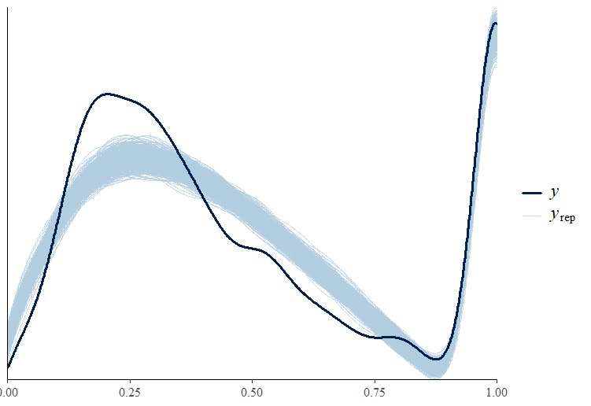
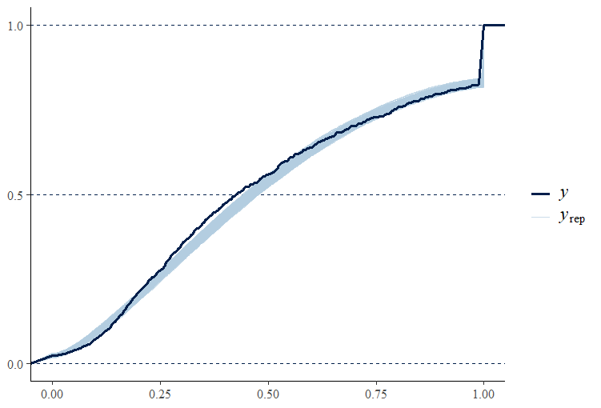
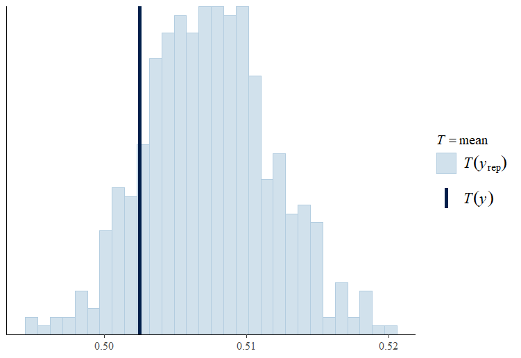
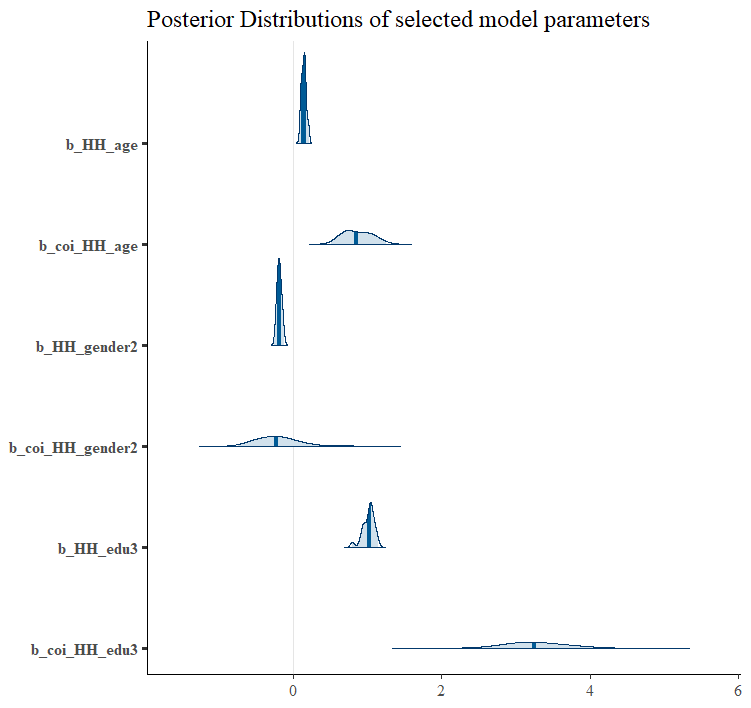

```{r setup, include=FALSE}
knitr::opts_chunk$set(echo = TRUE)
```

# Introduction

The data used in this analysis comes from the National Health and Nutrition Examination Survey (NHANES) conducted in August 2021 to August 2023.

This project aims to run a regression to model how demographic features affect the family monthly poverty income ratio which is "the ratio of monthly family income to the HHS poverty guidelines specific to family size" (cited from NHANES). Specfically it aims to model the household reference person's education, gender and education's effects on the , adjusted for the number of people in the household.

Disclaimer: I self taught most of this and there is still an ocean of things to learn, so if you spot any error along the way that's probably the reason. With that in mind, we shall begin!

# Loading the libraries and the data

We first load the required libraries

```{r message=FALSE, warning=FALSE}
library(haven)
library(tidyverse)
library(mice)
library(miceadds)
library(brms)
library(posterior)
library(bayestestR)
library(broom.mixed)
library(bayesplot)
```

And then we can load our data and join them accordingly

```{r}
demographic <- read_xpt("DEMO_L.xpt")

income <- read_xpt("INQ_L.xpt")

df <- inner_join(demographic, income)

df <- df %>% select(
 ID = SEQN,
 num_ppl = DMDHHSIZ,
 HH_gender = DMDHRGND,
 HH_age = DMDHRAGZ,
 HH_edu = DMDHREDZ,
 poverty_index = INDFMMPI
)
df <- df %>% mutate(
  HH_gender = as.factor(HH_gender),
  HH_edu = as.factor(HH_edu)
)
```

We then check the presence of missing data

```{r}
ini <- mice(df, maxit = 0)
ini$nmis
md.pattern(df)
```

And of course there is missing data, can't have it too easy!

Now, with missing data, we have 2 popular approaches, multiple imputation and complete case analysis, if we can assume a "Missing at Random" (MAR) structure to the missingness, multiple imputation should be favored as it can avoid bias in our modeling and discarding infromation unlike complete case analysis.

So, let us boldly assume MAR for a second (we will come back to this) and let's perform a multiple imputation to our data

```{r}

if(FALSE){
df_imp <- futuremice(df, m = 20, parallelseed = 555, method = "rf", 
                     maxit = 10, ntree = 25, 
                     verbose = T, n.core = 14)
saveRDS(df_imp, "imputed_data.RDS")
}

df_imp <- readRDS("imputed_data.RDS")

complete_df <- complete(df_imp, "long", include = T)
```

We can compare the distributions of the poverty_index before and after the imputations as a crude test to see if the imputed values are very off

```{r message=FALSE, warning=FALSE}
ggplot(complete_df, aes(x = poverty_index)) +
  geom_histogram(binwidth = 0.1, fill = "blue", color = "black", alpha = 0.7) +
  labs(title = "Distribution of Poverty Index",
       x = "Poverty Index",
       y = "Frequency") +
  theme_minimal()


ggplot(df, aes(x = poverty_index)) +
  geom_histogram(binwidth = 0.1, fill = "red", color = "black", alpha = 0.7) +
  labs(title = "Distribution of Poverty Index (Original Data)",
       x = "Poverty Index",
       y = "Frequency") +
  theme_minimal()
```

It looks good! And it is also a good time to discuss the model we will be using for this analysis. As you can see, the distribution of poverty_index is highly irregular, NHANES censored all data points beyond the value of 5, and obviously, a ratio cannot drop below 0, so we see there are 2 point masses at 0 and 5. It seems reasonable to me to model this weird distribution (with a scaling) with a zero one inflated beta model which works as following:

1. Each data point has a probability π to be at the point masses (i.e. 0 or 1), this probability is called the "Zero-One inflated part" (zoi).

2. If the data point is at one of the point masses, it has a probability λ to be exactly 1, this is called the "Conditional-One inflated part" (coi).

3. If the data point is NOT at the point masses, then it follows a beta distribution with location and scaling parameters (μ, φ).

So before we proceed, we should scale our dataset accordingly

```{r}
complete_df <- complete_df %>% mutate(
  poverty_index_scaled = poverty_index / 5,
  HH_edu = as.factor(HH_edu),
  HH_gender = as.factor(HH_gender)
  #doing as.factor() again just to be sure, I messed up once
)

complete_df <- as.mids(complete_df)
```

# Model fitting using Hamiltonian Monte Carlo

We can now start to define our models for brms to compile into Stan/C++

```{r}
formulas <- bf(poverty_index_scaled ~ num_ppl + 
                 HH_gender + HH_age + HH_edu,
               phi ~ num_ppl + HH_gender + HH_age + HH_edu,
               zoi ~ num_ppl + HH_gender + HH_age + HH_edu,
               coi ~ num_ppl + HH_gender + HH_age + HH_edu
               )
if(FALSE){
imp_fit <- brm_multiple(formulas, data = complete_df,
                       family = zero_one_inflated_beta(),
                        chains = 4, iter = 2000, cores = 4,
                        seed = 555)
                        

#The old gods have forsaken these chains. 
#The frogs are leaping and leaping and leaping and leaping... 
#All they have got is the remembrance of the conjugate priors. 
#The Hamiltonian paths of the spheres tumbling down 
#the wicked hills of the Log-posterior-Stan
#fluttering in numerical fluctuations.
#All is lost, all is lost...

saveRDS(imp_fit, "impfit.RDS")
          }

imp_fit <- read_rds("impfit.RDS")
```

After the excruciating Hamiltonian physics fueled black magic, we need to perform some diagnostics to ensure that the chains have indeed converged and we have enough valid samples to move forward. We need some careful handling here because the naive diagnostics will make no sense with our model fitted on multiply imputed datasets.

```{r message=FALSE, warning=FALSE}
#The following code is modified
#from the code given in brms documentation

draws <- as_draws_array(imp_fit)
m <- 20

draws_per_dat <- lapply(1:m, \(i) subset_draws(draws, chain = i))
fit_check <- lapply(draws_per_dat, summarise_draws, default_convergence_measures())

problematic_list <- list()

for(i in seq_along(fit_check)) {
  problematic_rows <- fit_check[[i]] %>%
    filter(rhat > 1.01 | ess_bulk < 400 | ess_tail < 400)
  
  if(nrow(problematic_rows) > 0) {
    problematic_list[[paste0("dataset_", i)]] <- problematic_rows %>%
      mutate(dataset = i) %>%
      select(dataset, everything())
  }
}

all_problematic <- bind_rows(problematic_list)

if(nrow(all_problematic) > 0) {
  cat("Found", nrow(all_problematic), "problematic parameters across", 
      length(problematic_list), "datasets:\n\n")
  print(all_problematic, n = nrow(all_problematic))
} else {
  cat("No problematic parameters found in any dataset 
      (using criteria: rhat > 1.01 or ess_bulk < 400 or ess_tail < 400).\n")
}
```
We see the pathological variables are either borderline acceptable (i.e. rhat close enough to 1.01) or it is that is not of interest and is known to have difficult geometry for Hamiltonian Monte Carlo to sample from, namely lp__.

We can safely assume that the chains are converged well enough and we have enough sample size to make inference from.

Now we proceed to check if our model is able to capture the distribution of scaled_poverty_index with simulation. Note that due to computational constraints, we only check for one imputed dataset.

```{r message=FALSE, warning=FALSE}
if(FALSE){
pp_check(imp_fit, type = "dens_overlay", ndraws = 500, set.seed(555))
pp_check(imp_fit, type = "stat", stat = "mean", ndraws = 500, set.seed(555))
pp_check(imp_fit, type = "ecdf_overlay", ndraws = 500, set.seed(555))
}

```

## Density overlay plot:

```{r}

```

## Empirical cumulative distribution function plot

```{r}

```

## Simulated mean statistic plot:

```{r}

```

They are not too horrible if I do say so myself! Our model is able to capture the dynamic of the response distribution and the true mean falls in a probable region in our simulation. 

With these diagnostics, I am comfortable to say that our model has a pretty good fit.

The following is the model summary for those who are interested:

```{r}
imp_fit_broom <- tidyMCMC(imp_fit, conf.int = T)
print(imp_fit_broom, n = Inf)
```

There is too much to go over so I only pick the effect of HH_gender2 (i.e. the household reference person is female), HHage and HH_edu3 (i.e. the household reference person is a college graduate or above) on μ and on coi.

```{r}
if(FALSE){
  mcmc_areas(imp_fit, pars = c("b_HH_age", "b_coi_HH_age",
                             "b_HH_gender2","b_coi_HH_gender2",
                             "b_HH_edu3", "b_coi_HH_edu3"),
            prob = 0.95) +
  ggtitle("Posterior Distributions of selected model parameters")

}


```

So it can be interpreted that :

1. The higher the age of the household reference person is, the higher the scaled_poverty_ratio tends to be.

2. Households with female reference person tends to lower scaled_poverty_ratio.

3. Households with reference person with college degrees or above tends to higher scaled_poverty ratio.

It is also worth pointing out the posterior distribution of b_HH_edu3 has a bi or even tri-modal skewed distribution that frequentist modeling would have failed to account as frequentist methods rely heavily on asymptotic distribution properties.

# Sensitivity analysis on MAR assumption

We now have to face the worst nightmare that I have been avoiding. The MAR assumption we made earlier is necessary for justifying the validity of multiple imputation, but how can we be sure that this assumption is reasonable?

Short answer, we can't, at least, not with statistics. We can only argue for MAR using domain knowledge which I lack (we can't have everything in life, can we?). And even more, I suspect respondents with lower proverty_ratio are more likely to not answer possibly due to embarrassment, but it is just my two-cents. 

But we can simulate what would happen if it truly was missing NOT at random (MNAR) and there was a systemic bias? We can do this using the delta adjustment method. The idea is: What if we artificially add a bias term to missing value when we impute them?

This can be achieved by the following code adapted from Stef Van Burren from his book "Flexible Imputation of Missing Data":

```{r}
#Stef Van Burren code
delta <- c(-0.5)

post <- ini$post
imp.all.undamped <- vector("list", length(delta))

if(FALSE){
for (i in 1:length(delta)) {
  d <- delta[i]
  cmd <- paste("imp[[j]][,i] <- imp[[j]][,i] +", d)
  post["poverty_index"] <- cmd
  sens_imp <- mice(df,  method = "rf", m = 3, post = post, maxit = 10,
              seed = 555)
  }
  saveRDS(sens_imp, "sens_imp.RDS")
}


sens_imp <- readRDS("sens_imp.RDS")
```

Unfortunately, due to computational constraints (and my lack of patience), I am restricting to only one adjustment value and 3 imputed datasets. In a more rigorous setting, it is advisasble to test for more extreme values for delta and with more imputed datasets.

But now, we should scale the data again to match the input and impose the lower bound of 0

```{r}
sens_complete_df <- complete(sens_imp, "long", include = T)

sens_complete_df <- sens_complete_df %>%
  mutate(poverty_index = ifelse(.imp != 0 & poverty_index < 0, 0, poverty_index))

sens_complete_df <- sens_complete_df %>% mutate(
  poverty_index_scaled = poverty_index / 5,
  HH_edu = as.factor(HH_edu),
  HH_gender = as.factor(HH_gender)
  # I am really paranoid about as.factor()
)

sens_complete_df <- as.mids(sens_complete_df)
```

We can now fit a model again on this newly imputed dataset

```{r}

if(FALSE){
delta_sens_fit <- brm_multiple(formulas, data = sens_complete_df,
                       family = zero_one_inflated_beta(),
                        chains = 4, iter = 2000, cores = 4,
                        seed = 555)

saveRDS(delta_sens_fit, "delta_sens_fit.RDS")
}

delta_sens_fit <- readRDS("delta_sens_fit.RDS")
```

We can go through the diagnostics again but I don't want to bore you with details. I have checked, the chains converged.

Then, we can compare the old models with our model fitted on adjusted data side by side to see if our conclusions would have changed given MNAR

```{r}

imp_fit_broom <- tidyMCMC(imp_fit)
imp_fit_renamed <- imp_fit_broom %>%
  rename_with(~ paste0(., "_imp"), -term)

delta_sens_fit_broom <- tidyMCMC(delta_sens_fit)

delta_sens_fit_renamed <- delta_sens_fit_broom %>%
  rename_with(~ paste0(., "_delta_sens"), -term)

combined_table <- imp_fit_renamed %>%
  left_join(delta_sens_fit_renamed, by = "term")
print(combined_table %>% select(
  "term", "estimate_imp", "estimate_delta_sens"
), n = Inf)
```

We see the directions of the model parameters are mostly consistent, implying that if the systemic bias was less than or equal to -0.5 on the unscaled poverty_index, our conclusion will remain the roughly the same. But for b_zoi_edu2 and b_coi_HH_edu2, they have opposite effect directions so our conclusions may not be entirely robust under mis-specified missing mechanism

Again, ideally we would explore more extreme bias, but HMC takes a long long time to run and I was getting grumpier and grumpier as it runs, so I will call it here.

# Conclusion

In this project, I have performed Bayesian regression on the multiply imputed NHANES dataset with brms (and Stan underneath the hood) with diagnostics of HMC and the fit, as well as sensitivity analysis on the data missing mechanism. I am still working on my skills on summarizing a complex model and I am trying to perform data visualization better so pardon if it was not the best.

But anyway this basically it for the project and below I will include my code at attempting to incorperate informative priors (that I made up).

# Informative prior modeling (not relevant to the analysis)

We first set the priors that I made up

```{r}
priors <- c(set_prior("normal(-1,5)", class = "Intercept", dpar = "mu"),
            set_prior("normal(-1,5)", class = "Intercept", dpar = "coi"))
```

Then we use some of the imputed datasets to continue in order to cut down computation

```{r message=FALSE, warning=FALSE}
partial_complete_df <- subset_datlist(
  datlist = datlist_create(complete_df),  
  index = c(4,6)
) %>% datlist2mids()
```

And run HMC to fit the model

```{r}
if(FALSE){
prior_sens_fit <- brm_multiple(formulas, data = partial_complete_df,
                       family = zero_one_inflated_beta(),
                       prior = priors,
                        chains = 4, iter = 2000, cores = 4,
                        seed = 555)
saveRDS(prior_sens_fit, "prior_sens_fit.RDS")
}

```

Compare this with old model

```{r}
imp_fit_broom <- tidyMCMC(imp_fit)
prior_sens_fit <- readRDS("prior_sens_fit.RDS")
sens_fit_broom <- tidyMCMC(prior_sens_fit)


imp_fit_renamed <- imp_fit_broom %>%
  rename_with(~ paste0(., "_imp"), -term)

sens_fit_renamed <- sens_fit_broom %>%
  rename_with(~ paste0(., "_sens"), -term)

combined_table <- imp_fit_renamed %>%
  left_join(sens_fit_renamed, by = "term")


print(combined_table %>% select(
  "term", "estimate_imp", "estimate_sens"
), n = Inf)

```

The direction of the effect stays the same, but our prior isn't really that informative anyway